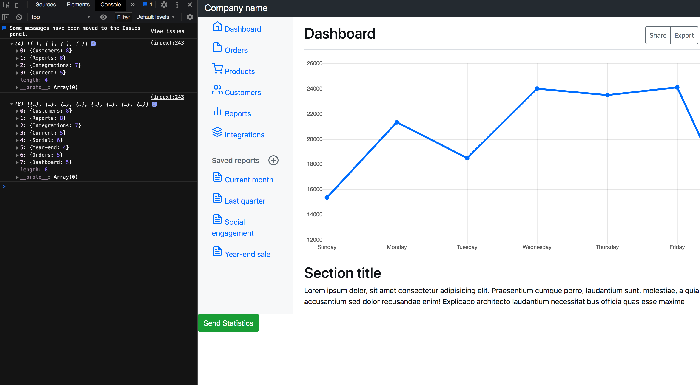
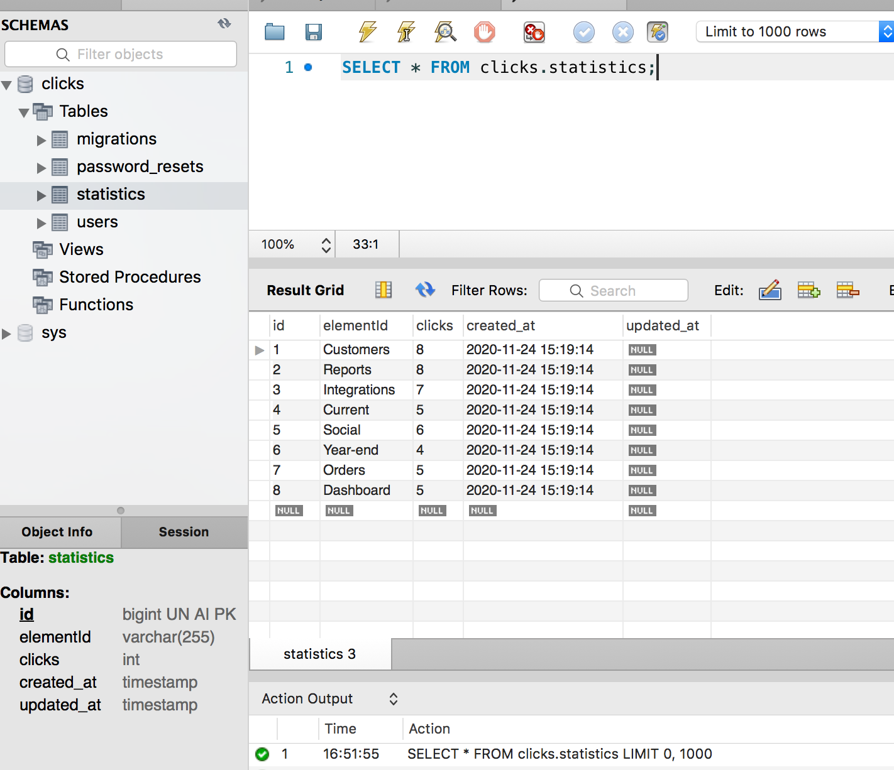
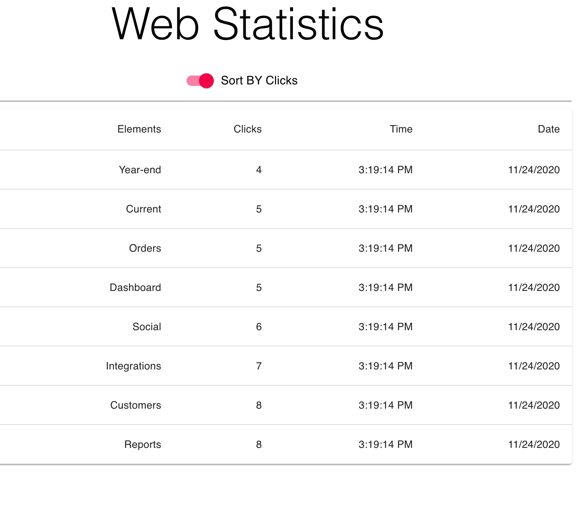

One central database integrates several interfaces. 
Laravel creates the DB when the user visits the site. Embedded JS script sends the statistics to the DB. 
Node.js REST API submits the information to external React application with react-material admin panel.

 

 

 

